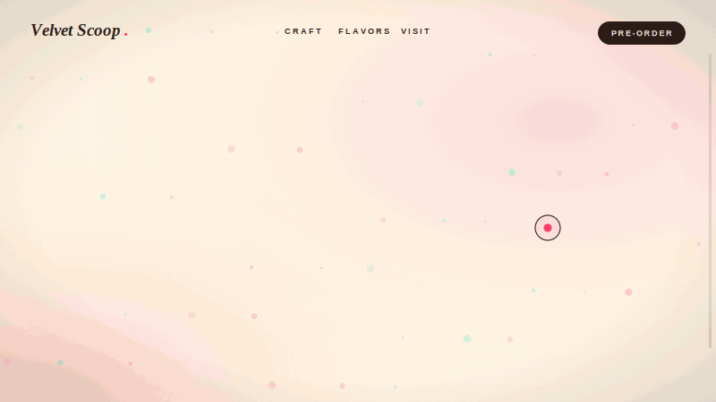

# Velvet Scoop — Design Documentation



*Animated preview, drawn as SVG frames and assembled into a GIF by [`assets/make_preview.py`](assets/make_preview.py). It uses stand-in fonts and simplified shapes, so treat it as an illustration of the experience rather than a screenshot.*

**Contents**
1. [Concept](#1-concept)
2. [Themes](#2-themes)
3. [Design tech](#3-design-tech)
4. [Design knowledge base](#4-design-knowledge-base)

---

## 1. Concept

Velvet Scoop is a single-page landing site for a small-batch gelato shop. The idea is a *dreamy WebGL creamery*: three 3D models (cone, scoop, ice-cream bar) float behind the page and are choreographed by scroll, the cursor and the flavor you pick. Everything else (cream background, frosted-glass cards, soft gradients, film grain) is there to make the 3D feel like it lives inside the page rather than sitting on top of it.

**Page structure:** fixed nav → Hero → ingredient marquee → The Craft → Flavors → Visit → footer, with the Scoopy chatbot floating bottom-right.

**Voice:** short, sensory, a little playful. "Melt Into The Moment", "Slow churned. Fast gone.", "Four moods. One cone.", "Come get a scoop." Section eyebrows are small, uppercase and widely tracked.

---

## 2. Themes

### 2.1 Base palette

Defined as CSS custom properties in `src/index.css` (`:root`).

| Token | Hex | Role |
|---|---|---|
| `--cream` | `#FFF5E1` | Page background, scrollbar track |
| `--cocoa` | `#2B1B17` | Body text, nav pill, marquee band, chatbot header |
| `--berry` | `#FF3366` | Primary CTA, eyebrow labels, user chat bubbles, cursor dot |
| `--strawberry` | `#FF6B8B` | Default accent (first flavor) |
| `--accent` | `#FF6B8B` → *changes* | **Live theme color** — overwritten when a flavor is picked |
| `--mint` | `#B5EAD7` | Secondary sparkles |
| `--pistachio` | `#C7E9B0` | Reserved green |
| `--gold` | `#E5A93C` | Reserved warm highlight |
| `--waffle` | `#D4A373` | End stop of the gradient text, cone color family |

Text selection uses `--berry` with white text. The scrollbar thumb is `--cocoa`.

### 2.2 Flavor themes (the dynamic theme system)

Four flavors in `src/lib/state.ts` each carry three colors, plus copy and price.

| Flavor | Tag | `accent` | `light` | `rim` | Price |
|---|---|---|---|---|---|
| Wild Strawberry | Electric Berry | `#FF6B8B` | `#ffd9e0` | `#FF3366` | $4.00 / scoop |
| Sicilian Pistachio | Mint Sundae | `#A8E6CF` | `#e2f7ec` | `#5fbf94` | $4.50 / scoop |
| Dark Cacao Fudge | Deep Chocolate | `#8a5a33` | `#f3e2cf` | `#5C3A21` | $4.50 / scoop |
| Mango Passionfruit | Sunshine Sorbet | `#FFB347` | `#ffe9c7` | `#ff8c42` | $4.00 / scoop |

- `accent` → UI color (CSS var `--accent`, gradient headline, selected-card outline and glow, cursor label fill)
- `light` → color of the 3D **key light**
- `rim` → color of the 3D **rim (point) light**

**How a theme switch flows:** clicking a flavor card calls `setFlavor(f)` in `App.tsx`. A `useEffect` then (a) sets `--accent` on `<html>` and (b) writes `accent/light/rim` into the shared mutable `themeState`. Inside the 3D frame loop, `ThemedLights` lerps the key and rim light colors toward `themeState` at **0.05 per frame**, so the whole scene re-lights smoothly rather than snapping. The gradient headline has a `0.8s` background transition for the same reason.

### 2.3 Typography

Loaded at runtime from Google Fonts via `@import` in `src/index.css`.

| Role | Family | Weights used | Applied by |
|---|---|---|---|
| Display / headlines | **Playfair Display** | 700, 900, italic 600, italic 800 | `.font-display` |
| Body / UI | **Plus Jakarta Sans** | 400, 500, 600, 800 | `html, body` default |

Patterns:
- **Fluid hero sizes** with `clamp()`: hero `clamp(3.5rem, 12vw, 10rem)`, Visit `clamp(3rem, 9vw, 7.5rem)`.
- **Eyebrow labels:** `text-[11px] font-extrabold uppercase tracking-[0.35em]` in `--berry`.
- **Italic for emphasis:** key phrases ("The Moment", "Fast gone.") are italic display type, either gradient-filled or outlined.
- Buttons and nav use small uppercase with wide tracking (`text-[13px] font-bold uppercase tracking-widest`).

### 2.4 Surfaces and effects

| Effect | Class / location | Spec |
|---|---|---|
| **Frosted glass** | `.glass` | `rgba(255,245,230,.55)` fill, `blur(18px) saturate(1.3)`, 1px `rgba(255,255,255,.65)` border, shadow `0 20px 60px -20px rgba(43,27,23,.25)` |
| **Gradient text** | `.text-gradient` | 100° gradient `--accent 10% → --berry 45% → --waffle 90%`, clipped to text |
| **Outlined text** | `.text-outline` | transparent fill, `-webkit-text-stroke: 1.5px var(--cocoa)` |
| **Film grain** | `.grain::after` | fixed SVG `feTurbulence` noise, opacity `.05`, jittered with `steps(4)` every 0.9s |
| **Glow pulse** | `.animate-glow` | `box-shadow` breathing in `--accent`, 3s ease-in-out loop (primary CTA, chat launcher) |
| **Marquee band** | `.animate-marquee` | cocoa strip of ingredient claims, 22s linear loop, content duplicated for a seamless `-50%` translate |
| **Shapes** | Tailwind | pills for buttons (`rounded-full`), `rounded-3xl` for cards, `rounded-[2rem]` for flavor cards |

---

## 3. Design tech

### 3.1 Stack

| Layer | Technology | Version (installed) | Used for |
|---|---|---|---|
| UI framework | React + TypeScript | 19.3 / 5.9 | components, state |
| Build | Vite (+ `@vitejs/plugin-react`) | 7.3 | dev server, bundling; `@` alias → `src` |
| Styling | Tailwind CSS (+ `tailwindcss-animate`) | 3.4.19 | utility styling; custom CSS in `index.css` |
| 3D | three, `@react-three/fiber`, `@react-three/drei`, `@react-three/postprocessing` | 0.186 / 9.8 / 10.7 / 3.1 | the floating models, lights, effects |
| UI motion | framer-motion | 14.0 | scroll-reveal, chatbot open/close, hover/tap |
| Scroll engine | Lenis + GSAP `ScrollTrigger` | 1.3.26 / 3.15 | inertial scrolling and page-progress value |
| Routing | react-router | 7.x | `BrowserRouter` wraps `<App/>`; no routes defined yet |
| Hosting | Render static site (`render.yaml`) | Node 20 | build `npm install && npm run build`, publish `dist`, SPA rewrite `/*` → `/index.html` |

### 3.2 The 3D scene (`src/components/Scene.tsx`)

- **Canvas:** fixed full-screen layer behind the content (`z-0`, `pointer-events-none`), transparent background, `dpr` capped at `[1, 2]`, camera at `[0, 0, 7]`, FOV 42.
- **Models:** `cone.glb` (~190 KB), `scoop.glb` (~186 KB), `bar.glb` (~77 KB) in `public/models`, preloaded with `useGLTF.preload`. A `NormalizedModel` helper clones each GLB, scales it to a target size (cone 2.6, scoop 1.4, bar 1.5) and re-centres it, so any exported model drops in without per-asset tuning.
- **Lighting:** ambient `0.9` (`#fff6ea`), directional key `1.6` (themed `light`), point rim `12` (themed `rim`), overhead spot `1.2`; HDRI from `Environment preset="city"`.
- **Atmosphere:** two `Sparkles` fields (90 pink `#FFB7B2` at size 3.5, 50 mint `#B5EAD7` at size 6) and `ContactShadows` under the models.
- **Post-processing:** `Bloom` (intensity 0.55, threshold 0.75, mipmap blur), a barely-there `ChromaticAberration` (0.0006), and `Vignette`.

### 3.3 Motion system

| Driver | What it controls | Key numbers |
|---|---|---|
| **Scroll** (Lenis + ScrollTrigger → `scrollState.progress`, 0→1 over the page) | Hero cone zoom, spin, exit; satellite scoop and bar positions | Cone scale 1 → 1.9 over progress 0–0.35, back to 0.7 from 0.55; slides to x = −2.6 after 0.62; Y-rotation `t·0.25 + p·4π`. Lenis `lerp: 0.09` |
| **Pointer** | Cone parallax | ±0.26 rad (~15°) on both axes |
| **Time** | Idle float | Sine bobbing on every model, drei `Float` wrappers |
| **Reveal** (framer-motion `Reveal` component) | Text and card entrances | `y: 60 → 0`, opacity 0 → 1, 0.9s, ease `[0.22, 1, 0.36, 1]`, fires once at `-80px` margin; stagger delays 0.1–0.15s |
| **Hover** | Cards and CTAs | craft cards `-translate-y-1`; flavor cards `-translate-y-2` over 500ms; buttons `scale-105` |

`scrollState` and `themeState` are plain mutable objects rather than React state. The 3D loop reads them every frame, so scrolling never triggers React re-renders.

### 3.4 Custom cursor (`src/components/Cursor.tsx`)

A 10px berry dot follows the pointer exactly; a 40px ring trails it (position lerp `0.16`, scale lerp `0.14`). Over any element with `data-cursor="Label"` the ring grows to **3.4×**, fills with `--accent` and shows the label; over plain links and buttons it grows to **2.2×**. It only mounts on fine pointers (`(pointer: coarse)` devices keep the native behaviour), and the native cursor is hidden only under `(pointer: fine)`.

### 3.5 Scoopy chatbot (`src/components/Chatbot.tsx`)

- **Rule-based, no LLM:** typed text runs through ordered regex intents in `answer()`; tapped options run through a node graph (`NODES`) plus a guided order flow.
- **Option graph:** main menu → Flavors / Order / Dietary & allergens / Hours & location / Parties & events / Prices, each with sub-options and a back chip.
- **Order builder:** serving → flavor → scoops → topping → summary with a prefilled `wa.me` WhatsApp link.
- **Look:** 340px `.glass` panel, cocoa header with a live `--accent` status dot, berry user bubbles, white bot bubbles, pill-shaped option chips, Clear and ✕ controls in the header. Launcher is a glowing 🍦 button.
- **Behaviour:** spring open/close (framer-motion `AnimatePresence`), auto-scroll to the newest message.

---

## 4. Design knowledge base

### 4.1 Principles (as expressed in the code)

1. **One accent, many moods.** Everything flavor-specific funnels through `accent / light / rim`. Add a flavor, and UI and 3D lighting follow without extra work.
2. **3D is atmosphere, not a widget.** The canvas is `pointer-events-none` and sits behind content, and all text sits on `z-10`. The models react to scroll and cursor but never block interaction.
3. **Soft over sharp.** Generous radii, translucent glass, blurred shadows and cream-tinted lighting; the only hard contrast is cocoa on cream.
4. **Motion is eased, never snapped.** Lerps for lights, cursor and scroll; a custom cubic-bezier for reveals; springs for the chatbot.
5. **Shared mutable state for per-frame data.** Scroll and theme live outside React so the render loop stays cheap.
6. **Warm, edible color.** The palette is drawn from the product itself: cream, cocoa, berry, pistachio, mango, waffle.

### 4.2 Layer map (z-index)

| Layer | z | Element |
|---|---|---|
| 3D canvas | `z-0` | `Scene` (fixed, non-interactive) |
| Page content | `z-10` | hero, craft, flavors, visit, footer |
| Nav | `z-50` | fixed top bar |
| Chatbot | `z-[80]` | launcher and panel |
| Film grain | `z-90` | `.grain::after` |
| Cursor ring / dot | `z-[99]` / `z-[100]` | `Cursor` |

### 4.3 Where things live

| I want to change… | Edit |
|---|---|
| Base colors, fonts, glass / grain / marquee styles | `src/index.css` |
| Flavor names, copy, prices, theme colors | `src/lib/state.ts` |
| Models, lights, bloom, scroll choreography | `src/components/Scene.tsx` |
| Page sections, copy, nav, reveal animation | `src/App.tsx` |
| Cursor feel and labels | `src/components/Cursor.tsx` (labels via `data-cursor` attributes) |
| Chatbot answers, menus, order flow | `src/components/Chatbot.tsx` (`FLAVORS`, `NODES`, `TOPPINGS`, `WA_NUMBER`, `answer()`) |
| Deploy settings | `render.yaml` |

### 4.4 Recipes

**Add a flavor**
1. Add an entry to `FLAVORS` in `src/lib/state.ts` (include `id`, `accent`, `light`, `rim`) and extend the `FlavorId` type.
2. The flavors grid, accent switching and 3D re-lighting pick it up automatically (the grid is 4 columns at `lg`, so a fifth card wraps).
3. Add it to the separate `FLAVORS` list in `Chatbot.tsx` so the bot can answer about it.

**Re-theme the site:** change the `:root` tokens in `index.css`. Gradient text, selection color, scrollbar and glow all read from them. Update the matching hex values in `ThemedLights` defaults in `Scene.tsx` if you want the first paint of the 3D lights to match.

**Swap a 3D model:** drop the new `.glb` in `public/models`, point the `NormalizedModel url` at it, and adjust `size` only. Normalization handles centering and scale.

**Change the scroll story:** the choreography is the `zoomIn` / `zoomOut` math in `HeroCone` (and the `lerp` ranges in `SideScoop` / `SideBar`), all keyed to `scrollState.progress`.

**Add a chatbot option:** add a node to `NODES` (`text` and `chips`), then link to it from a parent chip with the same `id`.

**Regenerate the preview GIF**
```bash
pip install cairosvg   # plus ffmpeg on PATH
python3 docs/assets/make_preview.py
```

### 4.5 Known gaps and notes

These are observations from reading the code, listed so the next design pass starts from facts.

- **Reduced motion:** the live page doesn't respond to `prefers-reduced-motion` (only the unused template `App.css` does). Lenis smoothing, parallax, grain and marquee all run regardless.
- **Cursor labels are tiny:** `data-cursor` labels render at `4px` type, which is decorative rather than readable.
- **Two flavor lists:** the site uses `src/lib/state.ts`; the chatbot has its own `FLAVORS` with different names (e.g. "Electric Wild Berry", "Dark Cocoa Fudge", "Madagascar Vanilla Bean") and no Mango. Keeping them in sync is manual.
- **shadcn/ui is installed but unused:** `src/components/ui` has 53 generated components, none imported by the page. `tailwind.config.js` references shadcn color variables (`--background`, `--primary`, …) that `index.css` does not define, so those components would render unthemed if used.
- **Template leftovers:** `src/pages/Home.tsx` and `src/App.css` are the original Vite starter and aren't imported; `react-router` wraps the app but no routes exist.
- **Bundle size:** one JS chunk of about 1.7 MB (about 497 kB gzipped). Code-splitting the 3D scene would help first load.
- **Fonts:** loaded from Google Fonts at runtime; there is no local fallback beyond `serif` / `sans-serif`.

### 4.6 Glossary

| Term | Meaning here |
|---|---|
| **Accent / light / rim** | The three per-flavor colors: UI tint, 3D key light, 3D rim light |
| **themeState / scrollState** | Mutable objects read every frame by the 3D scene |
| **Reveal** | Reusable framer-motion wrapper for the fade-and-rise entrance |
| **data-cursor** | HTML attribute that gives an element a labelled, enlarged cursor |
| **Glass** | The frosted translucent card style (`.glass`) |
| **R3F** | React Three Fiber, the React renderer for three.js |
